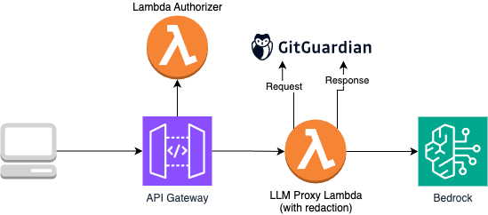
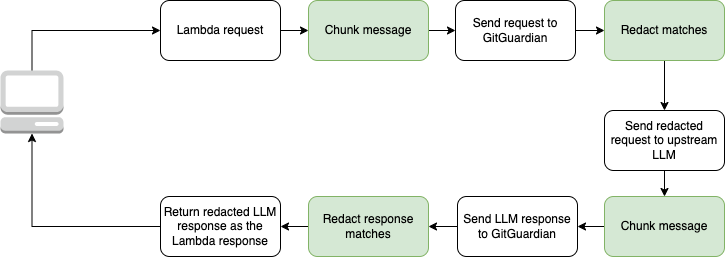

### Building a Secure LLM Gateway (and an MCP Server) with GitGuardian & AWS Lambda
*How I wrapped large-language-model power in a safety blanket of secrets-detection, chunking, and serverless scale.*

As organisations begin to adopt LLMs internally, **security and control become non-negotiable**. This post is a **proof of concept** that shows just how **straightforward it is to integrate GitGuardian’s Secrets Detection API** into an LLM workflow. We’ll start with a simple HTTP-based API and, through progressive enhancements, arrive at a gateway that routes, screens, and governs every request—culminating in deep GitGuardian integration and a custom MCP server.

Large-language models are now woven into everything from customer-support chatbots to internal knowledge bases. But letting users send raw prompts to a model—and letting the model’s raw output flow straight back—creates a glaring security gap. Users can accidentally paste an API key; a model can confidently hallucinate secrets that look real; and suddenly sensitive data is sitting in a log file or, worse, in a third-party SaaS.

To plug that gap, I built a **Secure LLM Gateway** backed by GitGuardian’s secrets-detection engine and running entirely on AWS Lambda. Over four iterative phases, the project matured from a simple proxy to a full serverless platform that also serves files through a Model Context Protocol (MCP) server — ensuring the payloads of each file are scanned.

---

## Phase&nbsp;1 – A Minimal, OpenAI-Compatible Proxy

I began with the leanest possible Lambda function fronted by API Gateway. It exposed `/v1/chat/completions`, validated incoming JSON, mapped it to AWS Bedrock (Claude 3 Sonnet in my first tests), and streamed the response back. By mirroring OpenAI’s request/response structure, any client library that already “spoke” OpenAI worked unchanged—only the base URL needed updating. Even at this early stage, IAM roles were locked down to Bedrock-only permissions and robust error handling protected the gateway from malformed payloads.

---

## Phase&nbsp;2 – Dropping GitGuardian into the Request Path

With basic forwarding stable, I introduced GitGuardian’s Secrets Detection API. Every incoming prompt was scanned before it ever touched a model; every model response was scanned before it left the gateway. Detected secrets were replaced with the token **REDACTED** while the message structure stayed intact. API keys lived securely in SSM Parameter Store, and CloudWatch captured a detailed audit trail: who sent what, when, and which rules fired.

[https://github.com/secronyx/secure-llm-gateway/tree/phase-2](https://github.com/secronyx/secure-llm-gateway/tree/phase-2

---

## Phase&nbsp;3 – Beating the 1 MB Limit with Smart Chunking

Real-world prompts—and especially model outputs—quickly exceeded GitGuardian’s 1 MB payload cap. Rather than truncate, I wrote a JSON-aware chunker that walks the incoming tree, slices arrays element-by-element or objects property-by-property, and labels each piece so it can be reassembled after scanning. The gateway swapped to GitGuardian’s *multiscan* endpoint, batching dozens of chunks in a single call and keeping latency low. A small CLI rounds out the tooling so I can test chunking locally on any JSON file.

---

## Phase&nbsp;3.1 – Add simple Lambda authorizer to the API Gateway

To complete the architecture and prepare for future access controls, I added a simple Lambda authorizer to the API Gateway. Right now, it unconditionally returns Allow for all requests—there’s no token validation or user lookup yet. The goal was to establish the pattern and wiring early, so upgrading to a real authentication flow later (JWTs, signed cookies, IAM checks) won’t require major changes. Even though it’s just a placeholder for now, having the authorizer in place makes it easy to plug in proper auth later without reworking the whole thing.

## Phase&nbsp;4 – The MCP Server: Secure File Fetches for LLMs

The final phase stretched beyond chat completions. Many advanced agent patterns need the model to “pull” external documents. To support that, I built a sister Lambda that implements the **Model Context Protocol (MCP)** using [this AWS sample serverless MCP project](https://github.com/aws-samples/sample-serverless-mcp-servers) as the base. I added an additional tool definition to the project—wired in via an argument—so the server and MCP clients stay in sync with the shared schema. This is an important detail since extending the MCP interface requires awareness of both sides of the contract.

The Lambda fetches a file using a `file_key`, screens the content using the same GitGuardian scanning pipeline (including chunking), and streams a redacted version back. I reused the GitGuardian wrapper built earlier for the Secure LLM Gateway, fetching the API key securely from AWS Parameter Store. The whole setup now runs behind an upgraded **API Gateway V2**, managed through Terraform for consistency with the rest of the stack. A synthetic data generator also tests all supported secret types, making sure redaction holds up under regression testing.

---

## What Makes the Stack Tick?

**Security first, everywhere.**
GitGuardian is embedded directly into the request and response flow, helping catch secrets before they ever leave the user or hit the model. Input validation runs from the first line of code, secrets detection wraps both sides of the LLM interaction, and CloudWatch logs are structured for security-first auditing.

**Terraform-defined, serverless-deployed.**
All infrastructure is authored and automated using Terraform, making it reproducible, version-controlled, and easy to evolve. We lean on the Serverless model—API Gateway, Lambda, and Bedrock—to stay lean, low-cost, and horizontally scalable without managing infrastructure.

**A safe and scalable proxy pattern.**
By building an OpenAI-compatible proxy that talks to Bedrock under the hood, we enable secure, governed access to AWS’s LLMs without needing clients to understand the underlying platform. It’s simple for developers, safe for organisations, and scalable from the start.

---

## Where It Can Go Next

I’d like to explore richer CloudWatch dashboards that break down GitGuardian detections by type and frequency. This could help surface usage patterns and reduce the risk of sensitive data making its way into prompts or completions. I’m also considering a lightweight caching layer for frequently requested documents to improve performance. The Lambda Layer will remain purely as a convenient way to share common libraries—chunking logic, GitGuardian wrappers, and utility functions—across multiple functions without duplication.

---

## Closing Thoughts

Building this gateway underscored a simple truth: **security isn’t a feature you bolt on; it’s the thread you weave through every layer**. By pairing GitGuardian’s scanning engine with AWS’s operational convenience, the system keeps costs sane while putting a solid lock between users, models, and any secret that tries to sneak through. And because the heavy lifting sits in small, testable modules, the platform is ready to evolve alongside the ever-growing landscape of LLM use cases—without ever letting its guard down.
