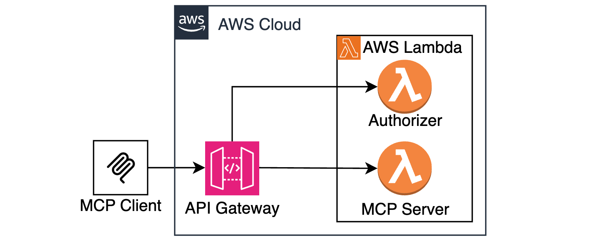

# Stateless MCP Server on AWS Lambda

This is a sample MCP Server running natively on AWS Lambda and API Gateway without any extra bridging components or custom transports. This is now possible thanks to the [Streamable HTTP](https://modelcontextprotocol.io/specification/2025-03-26/basic/transports#streamable-http) transport introduced in v2025-03-26. 



## Prereqs

* AWS CLI
* Terraform 

## Instructions

### Clone the project

```bash
git clone https://github.com/aws-samples/sample-serverless-mcp-servers.git
cd sample-serverless-mcp-servers/stateless-mcp-on-lambda
```

### Install dependencies

```bash
(cd src/js/mcpclient && npm install)
(cd src/js/mcpserver && npm install)
```

### Тest the server locally

```bash
node src/js/mcpserver/index.js
```

Once the server is running, run client in a separate terminal window

```bash
node src/js/mcpclient/index.js
```

### Deploy to AWS with Terraform

Run below commands to deploy the sample to AWS

```bash
cd terraform
terraform init
terraform plan
terraform apply
export MCP_SERVER_ENDPOINT=$(terraform output --raw mcp_endpoint) 
cd ..
```

Once deployment has completed, it might take about a minute for API Gateway endpoint to become available. 

### Test your remote MCP Server with MCP client:
```bash
node src/js/mcpclient/index.js
```

Observe the response:
```bash
Connecting ENDPOINT_URL=https://nh0u4q5dcf.execute-api.us-east-1.amazonaws.com/dev/mcp
connected
listTools response:  { tools: [ { name: 'ping', inputSchema: [Object] } ] }
callTool:ping response:  {
  content: [
    {
      type: 'text',
      text: 'pong! logStream=2025/05/06/[$LATEST]7037eebd7f314fa18d6320801a54a50f v=0.0.12 d=49'
    }
  ]
}
callTool:ping response:  {
  content: [
    {
      type: 'text',
      text: 'pong! logStream=2025/05/06/[$LATEST]7037eebd7f314fa18d6320801a54a50f v=0.0.12 d=101'
    }
  ]
}
```

## Statefull vs Stateless considerations

MCP Server can run in two modes - stateless and stateful. This repo demonstrates the stateless mode.

In stateless mode, clients do not establish persistent SSE connections to MCP Server. This means clients will not receive proactive notifications from the server. On the other hand, stateless mode allows you to scale your server horizontally.

If you want to see how to built a stateful MCP Server, that supports persistent SSE connections, see the `stateful-mcp-on-ecs` sample in this repo. 

## Authorization demo

This sample implements simple authorization demo with API Gateway Custom Authorizer. To enable authorization, update the `aws_api_gateway_method` resource in  `terraform/apigateway.tf`, and change authorization to CUSTOM. 

See transport initalization in `src/js/client.js` for how to add a custom authorization header. 

## Cost considerations

This sample provisions paid resources in your account, such as ECS Tasks and ALB. Remember to delete these resources when you're done evaluating.

```bash
terraform destroy
```

## Learn about mcp
[Intro](https://modelcontextprotocol.io/introduction)

[Protocol specification](https://modelcontextprotocol.io/specification/2025-03-26)
